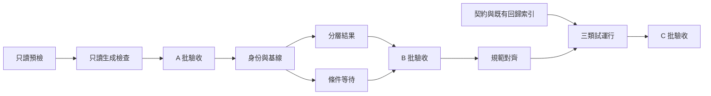

# 後續開發流程改進實施總計畫

> **給執行代理：** 實施時使用 `executing-plans` 技能逐項執行。只有使用者選擇平行代理方式時才改用 `subagent-driven-development`。勾選代表已有驗收證據；本文件的建立不代表已開始實施。

**目標：** 用三批、八個任務降低環境誤診、生成檢查誤報及頁面補證成本，保留尚未完成的外部驗收。

**架構：** 保留既有生成器、門禁及頁面適配器，補只讀預檢、暫存產物比較、報告身份及分層結果。规范對齊與契約索引集中在短入口，不新增另一套審批或測試框架。

**技術棧：** TypeScript、Node 22、npm 10 以上、Vitest、既有微信 DevTools／SDK、HTML／JSON／Markdown 報告。

## 全域約束

- 先讀倉庫 `AGENTS.md`；中文文檔及交互，小程序界面與資料使用繁體中文。
- Node `>=22 <23`、npm `>=10`；不以 Node 24 的失敗或成功作專案門禁結論。
- 禁止在 `main`／`master` 開發；實施分支使用 `codex/phase-N-描述`，實施前核對當時的 phase 編號。
- 保護 tracked／untracked／ignored 的既有輸入；不覆寫 `.codex/config.toml`、不清理其他 worktree。
- archive 只讀；人工資料只改 `data/master/`；產物只由工具生成。
- 不增刪升級依賴；不部署、不發布、不自動 commit／merge／push。
- 逻辑與生成檢查遵循紅→綠→重構；提交前執行相關門禁並展示變更、結果、擬用 message，取得當次授權。
- 涉及 UI 或共享頁面 runtime 的實施先完整讀 Design Foundation 及頁面 HTML 報告規範；技能分類任務另讀技能角標規範。
- 歷史失敗、blocked、SDK 探測及未完成真機／真雲驗收如實保留。

## 1. 規劃基線

基線 `79e778c4a69ad2a66d07e86f93023efde36a1b82`。規劃分支 `codex/phase-56-development-workflow-plan`。規劃前既有修改只有 `.codex/config.toml`；本輪只新增設計和計畫文檔，不修改實作。

設計輸入：[流程改進設計](../specs/2026-10-04-development-workflow-improvement-design.md)。R01–R26 的程式修復已記錄完成；本計畫繼承 [修復總計畫](2026-10-01-review-repair-plan.md) 的回歸證據與未驗收邊界。

## 2. 八個任務與驗收

| 批次／任務            | 優先級 | 依賴                             | 可獨立驗收的交付物                | 完成條件                                                                      |
| --------------------- | ------ | -------------------------------- | --------------------------------- | ----------------------------------------------------------------------------- |
| A1 只讀預檢           | P1     | 無                               | `workflow:preflight`              | 提前辨識 Node／輸入／配置問題；沒有下載或覆寫                                 |
| A2 只讀生成檢查       | P1     | A1 的預檢入口；比較器可先做      | 新 `generate:check`               | dirty 合法產物可通過；漂移、非確定、輸入變動分別失敗；候選檔案未變            |
| B1 頁面身份與基線     | P1     | A 完成後接入；身份邏輯可獨立測試 | 帶來源及實測身份的新報告          | 不跨 fixture／場景套圖片；不同版本可正確 before／after 對照；未知欄位如實顯示 |
| B2 分層結果           | P1     | B1 的 schema 遷移集中合併        | UI／repository／external 結果一致 | final 倉庫失敗在 HTML／JSON／Markdown／CLI 同時可見                           |
| B3 有界條件等待       | P2     | B1 的正式工具證據                | `waitUntil` 及一個遷移場景        | 非同步條件到位後再斷言；超時有限、協議錯誤不吞沒、恢復上限不變                |
| C1 規範與現況入口     | P1     | A、B 的最終接口                  | AGENTS／CLAUDE／README 對齊       | 當前雲端例外、資料採納邊界、工具副作用及證據要求一致                          |
| C2 操作契約與回歸索引 | P2     | 無；可早於 C1 整理               | 四类風險到現有測試的映射          | 所有列出的契約有來源；已有回歸不重寫；真缺口另有紅測試或清楚任務              |
| C3 三類試運行         | P2     | A1–C2                            | 同一候選版本的試運行記錄          | 只讀性、失敗分類及頁面報告被實際演示，外部缺口不被關閉                        |

詳細執行文件：

- [A：預檢與生成驗證](2026-10-04-workflow-verification.md)
- [B：頁面證據、結果和條件等待](2026-10-04-workflow-ui-evidence.md)
- [C：規範、契約與試運行](2026-10-04-workflow-conventions-and-contracts.md)

## 3. 執行順序與檢查點

B2、B3 會共享 `cli.ts`／`runner.ts`／`types.ts`，同一工作區順序修改，避免同時覆寫。C2 可以先做只讀整理；若使用者授權代理分工，僅將這類不共享修改檔案的工作分開。

不預先承諾日數。每批以驗收證據判定完成；若第一批能解決主要阻塞，可獨立投入使用，後兩批繼續按收益排序。

## 4. 每批的開始與結束

- [ ] 開始時保存 HEAD、分支、status、現有 diff 清單和需要保護的檔案 hash；先辨識 ignored 素材與私有配置。
- [ ] 在完整且輸入可追溯的隔離候選工作區實施；不要只複製 src／tests 後就宣稱重現成立。
- [ ] 先跑指定紅測試並保留失敗原因，做最小實作，再跑綠測試；格式化僅針對本批檔案。
- [ ] Node 22 下完成 `npm run verify` 與 `git diff --check`；工具副作用或生成漂移檢查不得吃掉合法待提交修改。
- [ ] CI 相關變更用乾淨 checkout 再驗；需要三張已發布 PNG 時在副本執行 `npm run assets:ci`，不在原工作區盲目覆蓋素材。
- [ ] UI 相關變更依唯一頁面規範留下正式適配器和實際 SDK／尺寸證據；離線樣例標明 fixture。
- [ ] 整理變更檔案、紅綠證據、全量門禁、未覆蓋範圍及擬用 message。提交、推送、合併仍須當次明確授權。

本機通過、乾淨 checkout 通過、遠端 CI 通過分別記錄。未推送時不能寫遠端 CI 通過。

## 5. 完成與剩餘工作

本計畫完成代表開發流程工具已按 A／B／C 驗證，不代表產品已通過所有設備與雲端验收。

長列表 510 行、四寬度／基礎庫、真機、QR／上傳包、真雲 ACL／並發／草稿、求解器數值／性能及資料語義複核，仍由 [收尾驗收隊列](2026-10-03-closeout-validation-followup.md) 與 [設計第 7 節](../specs/2026-10-04-development-workflow-improvement-design.md#7-待外部驗收的獨立隊列) 追蹤。不得用新增工具測試將其銷項。

## 6. 本計畫自檢

- [x] 已核對生成器、路徑 registry、CLI、adapter、runner、report、iteration 與既有回歸入口。
- [x] 任務含具體檔案、接口、紅測試案例、綠測試命令及驗收條件。
- [x] 新增接口均標為計畫接口；既有接口與未執行的探測能力分開。
- [x] 未要求安裝依賴、修改個人配置、重做 R01–R26 或自動提交。
- [x] 所有設計目標已映射到 A1–C3；產品外部验收單獨保留。

## 7. 接手提示

2026-10-05 交接狀態：尚未實施 A1–C3。HEAD 為 `79e778c4a69ad2a66d07e86f93023efde36a1b82`，分支為 `codex/phase-56-development-workflow-plan`。五份本計畫文檔均未追蹤；另外 `.codex/config.toml` 是既有使用者修改，必須保留。當前 PATH 是 Node 24.14.1，不能用它作專案正式門禁結論。

建立隔離工作區前先保護這五份未追蹤文檔，按原路徑複製並核對 hash：本總計畫、三份 `2026-10-04-workflow-*` 子計畫及設計文件 `2026-10-04-development-workflow-improvement-design.md`。不要假設從 HEAD 建立 worktree 就會取得這些文檔，也不要清理使用者原工作區。

> 請在 `E:\AI UWO assistant` 接手開發流程改進。先讀 `E:\AI UWO assistant\AGENTS.md` 和 `E:\AI UWO assistant\docs\superpowers\plans\2026-10-04-development-workflow-improvement.md`，再按其中入口讀對應設計與子計畫。完成 A1–C3，先做 A1、A2，每批驗收通過後繼續下一批。開始前核對實際 Git／Node 狀態，保護既有修改、五份未追蹤計畫及必要 ignored 輸入；在完整隔離候選中實施，定位並使用現有 Node 22。按紅→綠→重構執行，驗證只讀性、失敗分類及報告證據；計畫接口須以實際程式碼核對，若發現誤差先更新計畫再做最小實作。不要重做 R01–R26、夾帶業務重構、改依賴或個人配置，不提交、合併、推送或部署。若真機／真雲等前置條件不足，保留該項阻塞證據並繼續獨立工作，不降低斷言或偽造通過。最後交付變更、驗證、證據位置、未覆蓋項及下一步，停在可審閱狀態。

## 8. 2026-10-05 實施記錄

A1–C3 的程式、規範、契約索引和三類試運行已實施。紅綠測試、兩個隔離根的最終完整門禁、正式模擬器身份與來源保護證據見 [實施交付](../../audits/2026-10-05-development-workflow-implementation.md)。本文件第7節是當時接手提示，原五份規劃文檔在使用者工作區仍保持原 bytes。B1 的啟動紀錄、TypeScript映射及ES2020接口差異已按實際程式在交付中說明。2026-10-05 使用者回覆「正常」，補完本輪對照報告的 HTML 人工互動核驗；原自動化瀏覽器阻塞及其他產品外部驗收缺口仍保留。没有提交、合併、推送或部署。
