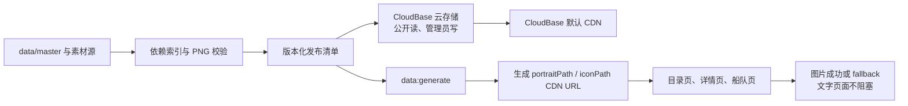

# CloudBase CDN 素材交付设计

> 状态：已获用户授权进入方案整理阶段，等待实施对话执行
>
> 适用分支：`codex/phase-7-cloudbase-cdn-asset-delivery`

## 目标

将航海士头像和技能图标从微信小程序本地素材分包迁移到微信云开发 CloudBase 云存储，通过公开 CDN URL 交付；保留本地文字数据和少量 UI 素材，使目录页、详情页和船队页不再依赖本地素材分包的页面跳转，同时保证首屏不被网络图片阻塞、失败可降级、发布可回滚、素材可确定性校验。

## 结论摘要

本项目的素材是开发者维护的公开只读静态资源，不是用户上传的私密文件。因此采用以下访问模型：

- CloudBase 传统云存储，公开读、管理员写。
- 构建/发布阶段上传素材；小程序运行时不调用 `wx.cloud.uploadFile`、`wx.cloud.downloadFile` 或 `wx.cloud.getTempFileURL`。
- 生成器把已发布版本的 HTTPS CDN URL 写入生成数据，运行时直接将 URL 交给 `<image>`。
- 使用版本化对象路径，禁止覆盖已经发布的对象路径。
- 默认先使用 CloudBase 提供的 CDN 域名，不引入自定义域名和独立 CDN 计费；未来更换域名只改变发布配置，不改变页面接口。
- 头像和技能图标迁移到 CDN；少量应用自有 UI 装饰图继续保留在本地，避免让基础界面完全依赖网络。

这不是把 `fileID` 当作图片 URL。`fileID` 只作为发布清单中的云端对象标识保存；公开资源的运行时引用使用稳定 HTTPS URL。私有文件的临时链接方案不适合本项目，因为会增加运行时请求、过期处理和缓存失效风险。

## 背景与问题

当前 Phase 6 的本地方案已经依据生成后的依赖关系建立 7 个素材根，并由 `asset-package-loader` 通过占位页导航加载素材分包。该机制仍然会让素材加载参与页面路由生命周期；在目录页 `onLoad` 阶段加载时，可能与微信页面路由完成竞争，触发 `routeDone with a webviewId ... is not found`。

现有生成依赖索引包含 627 名航海士、1203 个技能和约 1224 个去重后的业务 PNG。目录页只需要头像及每名航海士前 3 个主动/前 3 个被动技能图标；详情页和船队页按页面实际使用的头像和技能图标引用。素材依赖关系已经由 `tools/data-pipeline/asset-dependencies.ts` 统一计算，应继续作为 CDN 发布清单的唯一输入，不重新扫描页面模板猜测资源。

## 范围

### 本阶段包含

- CloudBase 云存储公开只读资源的发布配置和校验。
- 素材哈希、版本、云端路径、fileID、公开 URL、大小和 MIME 类型清单。
- 生成器输出 CDN URL。
- 目录页、详情页、船队页的图片按需加载和失败降级。
- 移除业务素材本地分包、占位页路由和 `asset-package-loader` 的运行时依赖。
- CDN 域名白名单、缓存、配额监控和回滚验收。

### 本阶段不包含

- 云数据库迁移。现有航海士、技能和字典数据仍由 `data/master/` 生成到小程序本地数据。
- 用户登录、用户隔离、用户上传文件或私有文件。
- 云函数、云托管、HTTP API、运行时远程数据接口。
- WebP 或其他图片格式转换。
- 自定义 CDN 域名、独立 CDN 产品接入和图片处理/数据万象。
- `archive/` 的任何修改。

## 全局约束

- `archive/` 只读；规范数据仍由 `data/master/` 维护；`miniprogram/generated/` 只能由生成工具产生，禁止手动修改。
- 小程序运行时代码禁止 `wx.request`、`wx.cloud`、任意第三方远程 URL 和 Node.js API。
- 由于本阶段明确引入 CDN，质量门禁需要增加一个受控例外：只允许生成数据中的图片字段使用配置的单一 HTTPS CDN origin；手写运行时代码仍不得出现远程 URL，任意其他远程 URL 继续失败。
- 不新增小程序运行时依赖，不把云端密钥、SecretId、SecretKey 或 CLI 凭据写入仓库。
- 所有数据解析、素材清单、URL 生成、去重、哈希和确定性构建逻辑遵循 TDD。
- 页面和用户可见文字使用繁体中文。
- 任何删除云端旧版本素材的操作都必须先有清单和回滚确认，不在普通构建或验证命令中自动删除。

## 目标架构



### 构建与发布边界

素材发布只发生在开发机或受控发布环境。发布工具使用 CloudBase 官方 CLI 或控制台完成上传，不把 CLI 或 SDK 加入小程序运行时，也不把发布凭据放进项目。普通 `npm run verify` 只检查清单和生成结果，不上传、不删除、不修改云端文件。

发布输入来自现有素材流水线的最终输出，而不是直接读取未校验的任意文件：

1. 由现有依赖索引确定实际需要的 PNG。
2. 由素材构建工具确认文件存在、文件名唯一、MIME 类型为 `image/png`、哈希和字节数稳定。
3. 为整批素材生成确定性的 release ID。
4. 上传到 CloudBase 云存储的版本化路径。
5. 对每个对象执行可访问性和响应头校验。
6. 生成 CDN manifest，再运行 `data:generate` 生成小程序数据。

### 版本与路径

发布版本由数据内容版本和素材清单摘要组成，例如：

```text
releaseId = <contentVersion>-<manifestDigest12>
cloudPath = assets/<releaseId>/<filename>.png
```

同一 `cloudPath` 不覆盖上传。素材内容变化时，即使文件名相同，也必须得到新的 `releaseId`。这样可以安全使用长期缓存，并通过回退旧的生成数据版本完成回滚。

清单至少包含：

```ts
interface PublishedAsset {
  sourcePath: string
  filename: string
  cloudPath: string
  fileID: string
  publicUrl: string
  sha256: string
  bytes: number
  contentType: 'image/png'
  releaseId: string
}
```

运行时只消费 `publicUrl`。`fileID` 只用于发布审计、云端管理和后续清理，不进入页面的图片 `src`。

### 权限

云存储使用公共静态资源权限：所有用户可读，仅发布管理员可写、覆盖和删除。公开读不等于公开写；不得给匿名用户开放上传、修改或删除权限。

素材本身是游戏资料，允许用户下载和缓存。若未来出现用户头像、订单凭证或私密文件，必须建立独立的私有资源方案，不得复用本公共资源路径。

### 缓存

资源路径包含 release ID，因此 PNG 可以设置长期缓存，目标为：

```text
Cache-Control: public, max-age=31536000, immutable
```

如果 CloudBase 控制台或当前环境不接受 `immutable`，至少保留一年级别的 `max-age`，并依赖版本化路径保证更新不受旧缓存影响。不得通过覆盖同一路径解决更新问题。

### 运行时加载

小程序不再通过素材占位页触发分包加载。页面行为统一为：

- 文字、筛选项和结构先使用本地生成数据渲染。
- `<image>` 直接使用生成的 HTTPS CDN URL。
- 目录列表启用图片懒加载，并只渲染当前批次；不在 `onLoad` 预取全部 1224 个素材。
- 详情页和船队页只根据当前页面实际生成的视图引用图片。
- 图片 `load` 成功后显示图片；`error` 后显示首字母、技能占位图或已有 UI fallback。
- 网络错误不清空页面，不阻塞文字资料，不触发页面路由跳转。
- 页面级“重新加载图片”最多触发有限次数的重试，不做无限重试，也不对永久 404 反复请求。

这样即使 CDN 暂时不可用，用户仍能打开目录、筛选航海士、进入详情和使用船队页面；仅图片区域降级。

## 费用控制

### 预期收费项

- CloudBase 套餐内的云存储容量和 CDN 流量额度。
- 超出套餐且开启超限不停服后的按量费用。
- 可选的自定义 CDN、图片处理、内容审核等独立能力。

### 明确不启用

- 自定义 CDN 域名。
- 云数据库和云函数。
- 运行时 `getTempFileURL` 批量换链。
- 图片处理、内容审核和格式转换服务。
- 自动打开超限不停服或自动购买资源包。

### 保护措施

- 首批只发布小规模验证素材，确认真机访问和计量情况后再全量发布。
- 使用 CloudBase 控制台配置存储、CDN 流量和余额告警。
- 发布脚本输出本次新增对象数、总字节数、预计版本大小和旧版本数量。
- 普通验证命令禁止上传和删除，避免测试产生外部费用或破坏回滚版本。
- 旧版本至少保留一个稳定回滚周期；清理前先生成删除清单并人工确认。
- 以“每用户实际下载的图片字节数 × 月活用户”估算流量，不以文件总数估算费用。

## 迁移流程

### 阶段 0：云端小规模验证

- 配置 CloudBase 环境和公开读/管理员写权限。
- 上传少量头像和技能图标到独立测试版本路径。
- 配置小程序允许的 HTTPS 域名。
- 在微信开发者工具、Android 真机和 iPhone 真机验证图片 URL、缓存和错误 fallback。
- 验证不需要 `wx.cloud` 运行时 API，不需要临时链接，不出现页面路由跳转。

阶段 0 不通过时，不进行全量上传和本地素材删除。

### 阶段 1：发布清单与构建门禁

- 新增发布清单类型和确定性摘要计算。
- 增加 CloudBase 发布适配层；上传命令和普通检查命令分离。
- 增加清单校验：缺失、重复、哈希变化、错误 MIME、错误版本和非配置域名 URL 都失败。
- 生成器只从清单读取公开 URL，不手动修改生成文件。

### 阶段 2：生成数据切换

- 将目录、详情、船队使用的头像和技能图标字段改为 CDN URL。
- 保留本地 UI 素材路径。
- 增加单一 CDN origin allowlist，禁止生成任意其他远程地址。
- 更新架构和运行时网络检查，使异常 URL 在构建期被发现。

### 阶段 3：页面运行时切换

- 移除三页对 `assetPackageLoader` 的依赖。
- 删除素材根加载状态和占位页导航状态，改为图片级加载/错误状态。
- 目录页使用懒加载和按批次渲染。
- 详情页和船队页可以直接进入，不依赖目录页先加载。
- 保留文本页面和图片 fallback。

### 阶段 4：本地业务素材清理

- 真机验证通过后，从 `app.json` 删除业务素材分包声明。
- 删除只用于业务素材加载的 placeholder 页面和 loader。
- 由工具清理本地生成的业务 PNG；不修改 `archive/`，不手动修改 `miniprogram/generated/`。
- 本地 UI 素材和数据生成流程继续通过现有门禁检查。

### 阶段 5：灰度发布与回滚

- 先发布 CDN 对象，再发布引用新 release ID 的小程序代码。
- 观察图片错误率、首屏图片成功率、CDN 流量和缓存情况。
- 发现问题时，只回退生成数据和小程序代码到上一 release ID，不删除云端旧版本。
- 稳定后再按删除清单清理超过回滚周期的旧版本。

## 测试策略

### 自动测试

- 素材依赖索引：相同输入得到相同文件集合和相同顺序。
- 发布清单：去重、哈希、MIME、字节数、版本和 URL 生成确定性。
- URL 安全：只接受 HTTPS 和配置的 CDN origin；拒绝任意远程 URL、查询 token、`cloud://` 运行时路径和不受控域名。
- 发布计划：缺失、重复、过期、错误大小、错误内容类型和未引用 PNG 都能被发现。
- 生成输出：目录、详情和船队所有图片字段指向同一 release ID；没有 `subpkg-assets-*` 路径。
- 页面测试：首屏文字先显示；图片失败不清空页面；详情和船队直接进入可用；图片重试有上限。
- 架构测试：运行时代码没有 `wx.request`、`wx.cloud`、Node.js API 或非 allowlist 远程 URL。

### 真机验收

- 冷启动进入目录页：文字立即出现，图片逐步出现，不发生页面跳转。
- 快速滚动：只加载当前视口附近图片，不一次请求完整素材集。
- 筛选和搜索：结果文字不等待 CDN，图片状态不会串到旧结果。
- 直接进入详情页：头像、完整技能图标和 fallback 正常。
- 直接进入船队页：候选人、技能摘要和头像正常。
- 关闭网络：页面仍可操作，图片显示 fallback，不出现空白页。
- 恢复网络：有限重试后图片可以恢复。
- 第二次进入：验证客户端和 CDN 缓存命中。
- 发布新 release：新旧版本 URL 不串，回滚旧 release 可用。
- Android、iPhone 和微信开发者工具分别验证。

## 验收标准

实施完成前必须同时满足：

1. CloudBase 公开读/管理员写权限生效，匿名访问一个测试 PNG 成功，匿名写入失败。
2. 所有业务 PNG 都有清单记录；清单和生成输出可重复构建。
3. 目录、详情、船队三页的图片 URL 只来自配置的 CDN origin 和当前 release ID。
4. 运行时不调用 `wx.cloud`、`wx.request`、`wx.downloadFile`，不通过 placeholder 页面加载素材。
5. 无网络或单图 404 时，页面仍保留文字和可操作结构。
6. 旧版本未被新版本覆盖，生成数据可以回退到上一 release ID。
7. 费用保护已配置，超限按量开关状态得到明确记录。
8. TDD 回归测试、lint、typecheck、runtime-network、data:check、assets:ui:check 和 `npm run verify` 按仓库门禁执行；既有未修改门禁问题必须单独报告，不得通过格式化无关文件掩盖。

## 参考资料

- [CloudBase 云存储](https://docs.cloudbase.net/storage/introduce)
- [CloudBase 云存储权限](https://docs.cloudbase.net/storage/data-permission)
- [CloudBase 云存储 SDK 与 fileID/下载链接](https://docs.cloudbase.net/storage/sdk)
- [CloudBase CDN 与缓存](https://docs.cloudbase.net/storage/pg/cdn)
- [CloudBase 价格文档](https://cloud.tencent.com/document/product/876/75213)
- [CloudBase 自定义 CDN](https://docs.cloudbase.net/storage/cdn)
